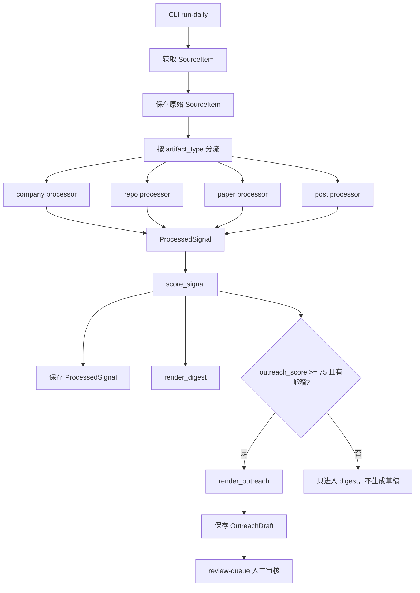

# 架构说明

这份文档回答三个问题：

1. 整体工作流是什么。
2. 每个工作流节点运行哪个脚本，输入输出是什么。
3. 哪些节点适合接入大模型，大模型应该输出什么，输出后用于什么场景。

当前代码是一个可运行 MVP：**采集、分流、processor、scoring、digest、建联草稿和 review queue 都已经跑通**。当前版本还没有真实调用大模型；memo 和 outreach 是确定性模板。后续接入大模型时，应优先接在 processor 后、memo 生成和邮件草稿润色这几个节点。

## 1. 总体工作流



核心原则：

- 不把 YC、GitHub、arXiv、X/HN 强行转成同一种公司结构。
- 只统一最外层 `SourceItem`。
- 根据 `artifact_type` 进入不同 processor。
- 打分使用确定性 rubric，不让大模型随口给分。
- 系统只生成建联草稿，不自动发邮件。

## 2. 工作流节点与脚本

| 节点 | 当前脚本 | 输入 | 输出 | 当前是否用大模型 | 说明 |
| --- | --- | --- | --- | --- | --- |
| 命令入口 | `src/sourcing_agent/cli.py` | CLI 命令 | 调用 workflow 并打印结果 | 否 | `run-daily`、`show-digest`、`review-queue` |
| 每日主流程 | `src/sourcing_agent/workflow.py` | `db_path`、`dry_run` | `DailyRunResult` | 否 | 串联采集、处理、打分、digest、草稿 |
| 来源解析 | `src/sourcing_agent/sources/*.py` | API/网页返回内容 | `SourceItem` | 否 | 当前有 GitHub、arXiv、X、HN、webpage 解析器 |
| 原始数据存储 | `src/sourcing_agent/db.py` | `SourceItem` | SQLite 记录 | 否 | 保存原始来源，方便复查 |
| 类型分流 | `src/sourcing_agent/routing.py`、`processors/__init__.py` | `SourceItem.artifact_type` | processor 名称或 `ProcessedSignal` | 否 | `company / repo / paper / post` |
| Company 处理 | `src/sourcing_agent/processors/company.py` | 公司/官网/YC 文本 | `ProcessedSignal` | 否 | 抽取公司名、创始人、产品信号、邮箱 |
| Repo 处理 | `src/sourcing_agent/processors/repo.py` | GitHub repo 信息 | `ProcessedSignal` | 否 | 抽取 stars、forks、语言、owner、benchmark/demo |
| Paper 处理 | `src/sourcing_agent/processors/paper.py` | arXiv paper 信息 | `ProcessedSignal` | 否 | 抽取作者、代码、数据集、benchmark |
| Post 处理 | `src/sourcing_agent/processors/post.py` | X/HN/launch post | `ProcessedSignal` | 否 | 抽取 traceable URL、互动数、launch 信号 |
| 打分 | `src/sourcing_agent/scoring/score.py` | `ProcessedSignal` | `ScoreResult` | 否 | 按类型 rubric 计算 `raw_score` 和 `outreach_score` |
| Memo | `src/sourcing_agent/outputs/memo.py` | `ProcessedSignal` + `ScoreResult` | Markdown memo | 否 | 当前是模板；后续适合接 LLM |
| Digest | `src/sourcing_agent/outputs/digest.py` | 多个 signal + score | Markdown digest | 否 | 按 `raw_score` 排序 |
| 建联草稿 | `src/sourcing_agent/outputs/outreach.py` | `ProcessedSignal` | `OutreachDraft` | 否 | 当前是中英文模板；后续适合接 LLM 润色 |
| 人工审核 | `src/sourcing_agent/review/api.py` | SQLite 中的草稿 | review queue dict | 否 | 只展示待审核草稿，不发送 |
| 定时入口 | `src/sourcing_agent/scheduler.py` | 无 | 可复用命令和 Codex prompt | 否 | 业务逻辑仍在 CLI，调度器只负责触发 |

## 3. 大模型节点设计

当前版本没有调用大模型。推荐未来只在这些节点接入模型：

| 推荐节点 | 触发位置 | 大模型输入 | 大模型输出 | 输出用例 | 为什么适合用模型 |
| --- | --- | --- | --- | --- | --- |
| Typed extraction | processor 之后、scoring 之前 | `SourceItem` + processor 初步结果 | 结构化 `ProcessedSignalPatch` | 补充 founder、market、technical artifact、evidence | 不同来源文本形态复杂，模型适合抽取半结构化信息 |
| Investment memo | `outputs/memo.py` | `ProcessedSignal` + `ScoreResult` + evidence | Markdown 或 JSON memo | 给投资人快速判断是否要看 | memo 是解释型输出，模型比硬模板自然 |
| Outreach draft | `outputs/outreach.py` | signal、score、机构介绍、语言偏好 | `{subject, body, language, evidence_refs}` | 生成待人工审核邮件草稿 | 模型适合个性化表达，但必须保留人工审核 |
| Risk review | scoring 之后 | signal、score、memo | risk flags | 标记误判、合规、过度推断风险 | 对“华人判断”“是否像群发”做二次检查 |

### 3.1 Typed extraction 建议输出

```json
{
  "summary": "One sentence summary.",
  "company_or_project_name": "Example AI",
  "founders": ["Name A"],
  "technical_artifact": "GitHub repo / paper / demo",
  "market_signal": "YC launch / customer / GitHub momentum",
  "china_affinity": {
    "level": "unknown | low | medium | high",
    "reason": "name_heuristic_only | public_bio | chinese_content | china_market",
    "evidence_url": "https://example.com"
  },
  "contact_paths": ["founder@example.com"],
  "evidence": [
    {
      "url": "https://example.com",
      "claim": "Founder background or product claim",
      "confidence": "low | medium | high"
    }
  ]
}
```

输出用例：

- 补齐 processor 没有抽到的创始人、联系方式、技术资产。
- 为 scoring 提供更干净的 `evidence` 和 `contact_paths`。
- 降低网页文本噪音对打分的影响。

### 3.2 Investment memo 建议输出

```json
{
  "what_it_is": "What the company/repo/paper/post is.",
  "why_now": "Timing and market window.",
  "technical_signal": "Technical evidence.",
  "traction_signal": "Momentum or adoption evidence.",
  "china_or_cross_border_signal": "Only if supported by evidence.",
  "risks": ["Risk 1", "Risk 2"],
  "recommended_action": "watch | shortlist | draft_outreach",
  "evidence_refs": ["https://example.com"]
}
```

输出用例：

- 每日 digest 可以展示 memo 摘要。
- review queue 可以展示完整 memo。
- 人工审批建联时能看到为什么这个项目值得聊。

### 3.3 Outreach draft 建议输出

```json
{
  "language": "en | zh",
  "subject": "Technical exchange around Example AI",
  "body": "Email body.",
  "personalization_points": [
    "Specific signal from the source"
  ],
  "evidence_refs": ["https://example.com"],
  "send_safety": {
    "has_public_contact": true,
    "looks_like_mass_email": false,
    "requires_human_approval": true
  }
}
```

输出用例：

- 生成中英文建联草稿。
- 保留个性化点，避免模板群发感。
- 进入 review queue，人工 approve 后再发送。

## 4. 数据对象流转

### 4.1 `SourceItem`

定义在 `src/sourcing_agent/models.py`。

用途：统一不同来源的最小外壳。

关键字段：

- `source`：来源名称，例如 `github`、`arxiv`、`yc`。
- `source_kind`：来源类型，例如 `GITHUB`、`ARXIV`、`WEBPAGE`。
- `artifact_type`：内容类型，例如 `company`、`repo`、`paper`、`post`。
- `title`：标题。
- `url`：来源 URL。
- `raw_text`：原始文本。
- `published_at`：发布时间。
- `metadata`：来源特有字段，例如 GitHub stars、arXiv authors。

### 4.2 `ProcessedSignal`

用途：processor 对 `SourceItem` 做类型化抽取后的结果。

关键字段：

- `summary`：简短摘要。
- `extracted`：类型特有结构化字段。
- `evidence`：支撑判断的证据。
- `china_affinity`：`unknown / low / medium / high`。
- `contact_paths`：email、URL 等可追踪或可联系路径。

### 4.3 `ScoreResult`

用途：打分输出。

关键字段：

- `raw_score`：线索本身值不值得看。
- `outreach_score`：是否值得生成建联草稿。
- `breakdown`：每个维度的分数。
- `confidence`：`low / medium / high`。
- `reasons`：达到哪些阈值。
- `caps_applied`：应用了哪些封顶。
- `penalties_applied`：应用了哪些扣分。

### 4.4 `OutreachDraft`

用途：待人工审核的建联草稿。

关键字段：

- `language`：`en / zh`。
- `subject`：邮件标题。
- `body`：邮件正文。
- `approved`：是否人工审批。

## 5. `score.py` 打分规则详解

打分入口是：

```python
score_signal(signal: ProcessedSignal) -> ScoreResult
```

整体分三步：

1. 根据 `artifact_type` 选择对应 rubric。
2. 计算各项 `breakdown` 并求和得到 `raw_score`。
3. 应用 cap / penalty，再得到 `outreach_score`。

### 5.1 通用规则

文本来源：

```text
signal.item.title + signal.item.raw_text + signal.summary
```

主题匹配：

- 使用 `config/taste_prompt.yaml` 中的 `preferred_themes`。
- 只要文本里命中任一偏好主题，就拿该项满分。

中国/跨境相关性：

```text
high    -> 该项满分
medium  -> 该项 70%
low     -> 该项 30%，至少 1 分
unknown -> 0 分
```

联系方式：

- 只有包含 `@` 的路径才算明确 email 联系方式。
- URL 可以作为 traceable path，但不能单独触发建联草稿。

### 5.2 Company 打分

适用于 YC、VC 官网、portfolio、公司官网。

配置来源：`config/scoring_rubrics.yaml` 的 `company`。

| 维度 | 分值 | 当前判断方式 |
| --- | ---: | --- |
| `theme_fit` | 20 | 命中 Taste Prompt 偏好主题 |
| `founder_signal` | 20 | processor 抽到 founders |
| `product_clarity` | 15 | 有 product signal 则满分，否则 7 分 |
| `traction` | 15 | 命中 `yc/customer/revenue/demo/invested/funding` |
| `timing` | 10 | 命中 `launch/new/recent/2026` 或有发布时间 |
| `china_affinity` | 10 | 根据 `high/medium/low` 折算 |
| `contactability` | 10 | 有明确 email |

### 5.3 Repo 打分

适用于 GitHub repo。

| 维度 | 分值 | 当前判断方式 |
| --- | ---: | --- |
| `growth_momentum` | 25 | stars >= 1000 得 25；>=300 得 18；>=100 得 10；否则 0 |
| `maintenance` | 15 | 有 `published_at` 得满分，否则 7 分 |
| `technical_depth` | 20 | 有 benchmark，或文本命中 `runtime/inference/scheduler/compiler` |
| `commercialization` | 15 | 命中 `platform/infra/enterprise/agents/robotics/hardware` |
| `maintainer_credibility` | 10 | 有 owner |
| `theme_fit` | 10 | 命中 Taste Prompt 偏好主题 |
| `contactability` | 5 | 有明确 email |

注意：repo 即使 raw score 很高，如果没有明确 email，`outreach_score` 会被封顶到 50。

### 5.4 Paper 打分

适用于 arXiv paper。

| 维度 | 分值 | 当前判断方式 |
| --- | ---: | --- |
| `novelty` | 25 | 命中 `new/novel/efficient/benchmark/state-of-the-art` 得满分，否则 10 分 |
| `commercialization` | 20 | 命中 `robotics/inference/hardware/platform/deployment/enterprise` |
| `author_credibility` | 15 | 有 authors |
| `implementation` | 15 | 有 code 或 benchmark |
| `theme_fit` | 15 | 命中 Taste Prompt 偏好主题 |
| `freshness` | 5 | 有发布时间 |
| `china_affinity` | 5 | 根据 `high/medium/low` 折算 |

### 5.5 Post 打分

适用于 X、HN、launch post。

| 维度 | 分值 | 当前判断方式 |
| --- | ---: | --- |
| `signal_quality` | 25 | 是 launch，或命中 `founder/built/demo`；否则 10 分 |
| `interaction_quality` | 20 | 互动 >=100 得 20；>=30 得 13；否则 5 |
| `traceability` | 20 | 抽到 traceable URL |
| `freshness` | 15 | 有发布时间，或命中 `launch/today/new` |
| `theme_fit` | 10 | 命中 Taste Prompt 偏好主题 |
| `contact_path` | 10 | 有 contact path |

注意：post 的 `contact_path` 可能只是 URL，不等于可发邮件。最终建联仍要求明确 email。

### 5.6 Cap 规则

| 规则 | 影响 |
| --- | --- |
| 没有 URL | `raw_score` 最高 50 |
| post 没有 traceable URL | `raw_score` 最高 65 |
| 没有明确 email | `outreach_score` 最高 50 |
| 没有 evidence | `outreach_score` 最高 50 |

### 5.7 Penalty 规则

| 规则 | 扣分 |
| --- | ---: |
| 命中 `pure ai wrapper / wrapper app / thin wrapper` | `raw_score - 20` |
| 命中 `series c / series d / ipo / public company` | `raw_score - 15` |

### 5.8 阈值规则

阈值来自 `config/taste_prompt.yaml`：

```yaml
thresholds:
  shortlist: 70
  memo: 80
  draft_outreach: 75
```

当前代码里：

- `raw_score >= 70`：添加 `shortlist_threshold_met`。
- `outreach_score >= 75`：添加 `outreach_threshold_met`。
- `workflow.py` 里只有当 `outreach_score >= 75` 且有明确 email 时，才生成 `OutreachDraft`。

### 5.9 Confidence 规则

`confidence` 不是模型置信度，而是规则命中覆盖度：

```text
正分维度 >= 5 -> high
正分维度 >= 3 -> medium
否则 -> low
```

## 6. 当前输出用例

### 6.1 Digest 输出

运行：

```bash
PYTHONPATH=src python3 -m sourcing_agent.cli run-daily --dry-run
```

当前输出用例：

```text
# 每日 AI 投资 Sourcing Digest

1. [Launch: AI hardware devkit](https://x.com/i/web/status/1)
   - 类型：post
   - 来源：x
   - Raw score：100，Outreach score：50
   - 摘要：Launch: AI hardware devkit for edge inference https://example.com/devkit
```

用途：

- 每天快速看 top signals。
- 先按 raw score 判断值得看什么。
- 再按 outreach score 判断是否值得建联。

### 6.2 Review Queue 输出

运行：

```bash
PYTHONPATH=src python3 -m sourcing_agent.cli review-queue
```

当前输出用例：

```text
1. Robotics AI Infrastructure [en]
   URL: https://example.com/robotics-ai
   Subject: Technical exchange around Robotics AI Infrastructure
```

用途：

- 人工审核建联草稿。
- 防止系统自动发信。
- 后续可扩展为网页 dashboard。

### 6.3 Outreach Draft 输出

当前英文标题：

```text
Technical exchange around {project}
```

当前中文标题：

```text
想就 {project} 做一次技术交流
```

用途：

- 作为人工审批前的邮件草稿。
- 后续可接 Gmail draft API，但仍建议默认 draft-only。

## 7. 下一步建议

优先级建议：

1. 把 `workflow.py` 的 `sample_items()` 替换成真实 source connector 调用。
2. 增加 `llm/` 目录，只在 memo 和 outreach 两个节点先接模型。
3. 给 `ScoreResult` 增加更细的解释字段，例如每个分数对应的 evidence。
4. 把 review queue 从命令行扩展成一个简单 FastAPI 页面。
5. 接 Codex automation 或 cron，每天运行：

```bash
PYTHONPATH=src python3 -m sourcing_agent.cli run-daily
```

